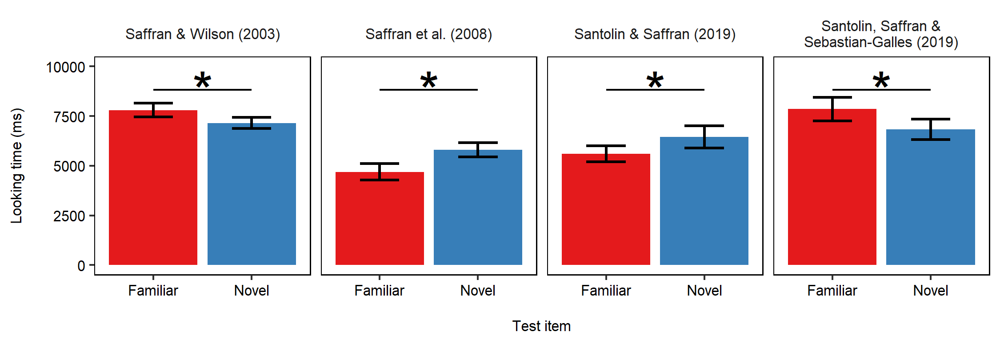

```{r setup, include = FALSE}
library(papaja)   # for APA formatting
library(knitr)    # for graphs and tables
library(magrittr) # for using pipes
library(dplyr)    # for manpulating data
library(tibble)   # for reshaping data-sets
library(here)     # for locating files
```

```{r analysis-preferences}
# Seed for random number generation
knitr::opts_chunk$set(cache.extra = knitr::rand_seed, out.width = "\\textwidth")


# import data
data        <- read.csv(here("Data", "01_data-processed.csv"))                           # main data-set
anova       <- read.csv(here("Data", "02_results-lmem.csv"))                             # ANOVA with HPP6
anova.novel <- read.csv(here("Data", "Dummy-coding-Novel", "02_results-lmem-novel.csv")) # ANOVA with HPP6 (novel is baseline)
anova4      <- read.csv(here("Data", "HPP4", "02_results-lmem-4.csv"))                   # ANOVA with HPP4

```

# Introduction

In infancy research, the importance of changes in preferential looking has been recognized since at least the 1960s, when psychologist @fantz1964 showed that young infants preferentially attend to novel over familiar visual stimuli. After repeated exposure to a visual stimulus, infants decreased their looking time to the familiar object, and increased their looking time to a novel object. Subsequent studies extended this evidence to other domains, including acoustic perception and cognition, revealing differences in direction of preference. Theories intended to account for such differences suggest that novelty preference arises when infants have completed the processing of a (familiar) stimulus [see @houston-price2004; @aslin2007 for reviews]. 

Rather than representing a binary distinction, direction of preference can be better described as a continuum from more familiar to more novel [e.g., @thiessen2005]. Different theoretical frameworks have been proposed to pinpoint the factors that determine whether a given task will show novelty or familiarity preference. @hunter1988 provide the most comprehensive model indicating three central factors that affect the strength and direction of preferential looking: age, familiarization duration and task complexity. In a given task, younger infants tend to prefer the familiar stimulus whereas older infants are more likely to prefer the novel one [e.g., @colombo1983; though see @bergmann2016, for a meta-analysis suggesting that age does not in fact predict shifts in preference]. A shorter exposure to familiar stimulus prior to testing also leads infants to subsequently prefer the familiar object. Task complexity refers to the stage of stimulus processing. For example, in a visual recognition task, 4-month-old infants revealed a systematic preference for the familiar object prior to showing a strong preference for the novel object [@roder2000]. It has been hypothesized that a preference for novelty emerged following a preference for the familiar only when the infant brain has successfully formed a memory trace of the familiar object [@rose2004]. Task complexity can also refer to the complexity of the stimuli. Sequential stimuli put greater strain on memory resources than stimuli in which all components are simultaneously available [e.g., @ferguson2018]. During a sequential presentation, each component must be stored in working memory, and that memory trace must be continuously updated until an overall representation of the sequence is formed [e.g., @roder2000; @awh2001]. A related dimension is the similarity across stimuli used at familiarization and test: when there is a close perceptual match (e.g., same colors or sounds during training and test), infants are more likely to show a novelty preference [e.g., @hunter1988; @thiessen2003]. 

The combination of these factors leads to predictions concerning direction of preference in (somewhat) systematic ways. For example, @thiessen2005 manipulated length of exposure and observed a flip from familiarity to novelty preference after doubling the amount of familiarization received by the infants. Similarly, @ferguson2018 manipulated sequential vs. spatial presentation of visual patterns, and observed stronger novelty effects with (a) increasing age and (b) spatial presentation. That said, it is also frequently the case that the observed direction of preference does not conform with expectations based on the dimensions noted above; the infancy literature is rife with examples of counterintuitive patterns of preference [e.g., @fiser2001; @thiessen2005 for post-habituation familiarity preference; @bosch2001; @sebastian-galles2009; @dawson2009 for novelty preference in 4 mos.; @jusczyk1995 for familiarity preference in 7 mos.; @johnson2009 for both novelty and familiarity preference in 11 mos.].

One frequently overlooked factor is that infants do not arrive at the lab as naïve participants. Like adults, they bring significant prior experience that may influence their performance in lab tasks. In many instances, researchers attempt to override or sidestep those experiences by using novel stimuli (e.g., unfamiliar languages, shapes, and/or sounds). But there may also be forms of experience that go unidentified by researchers. One such factor is that many infants participate in more than one experiment. Testing the same participants in multiple (putatively unrelated) experiments is a common practice in infant research, reflecting the challenges of advancing a field of investigation that is based on a limited and hard-to-recruit population. Researchers are typically very careful to avoid stimulus contagion across unrelated studies, but it is possible that prior lab experience impacts infants’ performance. 

The purpose of this article is to explore the effect of experience with experimental paradigms on direction of preference in learning tasks. This idea emerged from a puzzling pattern of results in a replication of a published study focused on non-linguistic artificial grammar learning in 12-month-olds [@santolin2019]. We observed a flip in preference from novelty to familiarity between the original study and its replication [@santolin2019a], despite the use of identical stimuli and procedures. While there were some differences between the studies (most notably, in the location in which the studies were run), one main factor jumped out at us: many of the infants in the study that elicited a novelty preference had participated in prior studies with Head-turn Preference Procedure (HPP), whereas most of the infants in the study that elicited a familiarity preference were first-time participants. We reasoned that the more familiarity infants had with the lab apparatus and task demands, the more likely they would be to learn rapidly, leading to a novelty preference. To explore this question, we combined the data from these two experiments with the data from two other published artificial grammar learning tasks with similar designs that included 12-month-olds with a range in number of lab visits [@saffran2008, Exp. 1 Language P; and @saffran2003, Exp. 2]. Our hypothesis was that the amount of infants’ prior experience with HPP would affect direction of preference. 

# Methods

A brief description of the four experiments included in this analysis, and our rationale for selecting them, is provided in the Supplementary Information (SI), Section 1 (see Fig. 1 for a summary of the results). A fully reproducible repository hosting Data and analyses is available at https://osf.io/g95ub/ and https://github.com/gongcastro/Flip.

```{r echo=FALSE, message=FALSE, warning=FALSE, paged.print=FALSE, fig.cap = "Looking time for familiar and novel test stimuli of the original studies. Stimuli vary based on the experiment. Error bars indicate the standard error of the mean."}



```

## Linear mixed-effect model

We modeled results of all infants (*N*=`r printnum(nrow(data)/2, digits = 0) `) who participated in the four studies. Number of HPP visits varied from one to six total visits (including the current visit). Since only a small set of infants participated in more than four experiments (*n*=`r data %>% filter(HPP > 4) %>% group_by(HPP) %>% summarise(n = n()/2) %>% ungroup() %>% summarise(n = n()) %$% n%>% printnum(digits=0)`), we also analyzed the results after reducing our sample to infants who only participated in one to three HPP experiments, obtaining similar results (see SI, Section 2 for details). 

We fit a linear mixed-effect model including *Looking time* as response variable, and *Test item* (familiar vs. novel), *HPP* (number of experiments conducted with the Head-turn Preference Procedure completed by infants) and their interaction as fixed effects. We also included by-participant and by-study random intercepts [4 levels: @santolin2019; its replication; @saffran2003; and @saffran2008], and by-study random slopes for the *HPP* predictor. The HPP predictor was coded as a continuous variable indicating the overall number of HPP experiments the infants participated in. Familiar test items were coded as baseline. Importantly, the model accounted for cross-participant and cross-study differences in looking time. The rationale behind this choice was that the experiments were similar but not identical, differing in the learning problem and the stimuli used at both familiarization and test. It was therefore reasonable to assume that differences on these dimensions would have affected looking time across studies. Details of the model are provided in SI, Section 3.

We predicted a *Test item* (familiar vs. novel) by number of HPP interaction, indicating that the duration of infants' looking towards familiar versus novel items would depend on infants’ HPP experience. 

# Results

We found a statistically significant interaction (*F*(`r printnum(anova$Df[4])`,`r printnum(anova$Df.res[4])`) `r printnum(anova$F[4], add_equals=TRUE)`, *p* `r printp(anova$p[4], add_equals = TRUE)`) suggesting that the effect of Test Items on looking time differences was affected by the number of HPP experiments infants had participated in (Fig. 2). In line with our predictions, the size of the difference between looking times on familiar and novel test items changed as a function of number of HPP visits. Importantly, results also hold when reducing the data to infants with three or fewer HPP visits (*F*(`r printnum(anova4$Df[4])`,`r printnum(anova4$Df.res[4])`) `r printnum(anova4$F[4], add_equals=TRUE)`, *p* `r printp(anova4$p[4], add_equals = TRUE)`), indicating that the interaction effect is not driven exclusively by infants with an unusually high number of visits (see SI, Section 4 for details). 

We also found a significant result of the HPP predictor (*F*(`r printnum(anova$Df[3])`,`r printnum(anova$Df.res[3])`) `r printnum(anova$F[3], add_equals=TRUE)`, *p* `r printp(anova$p[3], add_equals = TRUE)`) indicating that the Item by HPP interaction is mainly driven by a significant decrease in looking time to familiar items as the number of HPP visits increases. There was no evidence that a greater number of HPP visits was accompanied by longer looking to the novel item (*F*(`r printnum(anova.novel$Df[3])`,`r printnum(anova.novel$Df.res[3])`) `r printnum(anova.novel$F[3], add_equals=TRUE)`, *p* `r printp(anova.novel$p[3], add_equals = TRUE)`)^[To get this result, the same model was fit coding the novel test item as baseline, as opposed to the familiar item.].

```{r echo=FALSE, message=FALSE, warning=FALSE, paged.print=FALSE}

anova %>%
  mutate(term = c("Intercept", "ItemCenter", "HPP", "ItemCenter * HPP"),
         p = printp(anova$p)) %>%
  mutate_at(c(2, 4, 5, 6), printnum) %>%
  select(term, Coefficient, SEM, CI95, F, Df.res, p) %>%
  column_to_rownames("term") %>%
  kable(#note = "Degrees of freedom were approximated using the Kenward-Rogers approach, thus sometimes result in non-integers. ",
        col.names = c("Coefficient", "SEM", "95%CI", "F", "Den. df", "p"),
        row.names = TRUE,
        align = "c",
        digits = 3,
        caption = "Summary of the results of the linear mixed-effects model. Degrees of freedom were approximated using the Kenward-Rogers approach, thus sometimes result in non-integers.",
        format = "pandoc")

```

```{r echo=FALSE, message=FALSE, warning=FALSE, paged.print=FALSE, fig.cap="Predicted looking time plotted against number of HPP visits. Graph shows an increasing difference of looking time between familiar and novel test items, and a clear drop in looks for the familiar items."}

include_graphics(here("Figures", "03_interaction.png"))

```

# Discussion

Results reported in this article are consistent with our *a posteriori hypothesis* that experience with the Head-turn Preference Procedure affects direction of preference. We combined together 4 different experiments with 12-month-old infants performing simple artificial grammar learning tasks, and showed that infants who had not previously experienced the HPP setting were more likely to show familiarity preferences than infants who had prior experience. One possible explanation accounting for such finding relates to the structure of the HPP task. There are at least two types of information that must be simultaneously encoded by the infant at her first HPP experiment: 1) visual-auditory contingency (i.e., sounds appear contingently on the infant looking at the screen), and 2) the experiment stimuli (e.g., word sequences, sound streams). Therefore, infants have to engage in two concurrent learning when experiencing HPP for the first time: learning the structure of the HPP task, and solving the learning problem (e.g., discriminating sound strings following/breaking the grammar patterns). Such double-processing of information likely increases the overall difficulty of the study, biasing results towards familiarity preferences. Infants who return to the lab for subsequent HPP experiments may be more able to focus on the learning problem, resulting in better learning as evidenced in novelty preferences. 

It is important to notice that this effect may not just be limited to experiencing the the HPP setting per se, but can be caused by the entire laboratory visit. When infants come to the lab for the very first time, they face a challenging situation: they are moved into a new environment with new people interacting with them, and they enter into testing rooms with a peculiar design (e.g., all-black or all-white walls with big screens) where they are presented with novel sounds and images. This is a great amount of novel information for a young infant to process at once. In contrast, as the infants come back to the lab, location, testing room and research staff may become more familiar, reducing the information load. The present study cannot discern which type of previous experience (HPP setting or lab) is responsible for the observed results.

Our results are consistent with existing theories of cognitive development suggesting that, in spite of their limited capacities, infants 1) constantly gather input from the natural environment, 2) selectively sample the information to learn, and 3) direct their resources to examine the most relevant and informative input [e.g., @bates1996; @kidd2014; @santolin2018; @saffran2018]. Our results suggest that infants actively process information about the lab environment and, consequently, their test performance are affected by how much lab experience they have accumulated. The learning outcome, in fact, seems to be constrained by the amount of novel information infants have to process in parallel when visiting the lab.

Evidence provided in this article has important implications for future interpretation of directions of preference. Infants’ prior experience with the lab or a given research paradigm can account for different, and sometimes counterintuitive, patterns of preference. A related hypothesis suggests that less-frequent directions of preference with respect to the pattern of preferences shown in the literature of a given topic (e.g., rule learning) likely represent sign errors as opposed to true infant preferences [@rabagliati2019; @bergmann_rabagliati_tsuji_2019]. Alternatively, we propose that discrepancies in preferential looking are related to the infants’ background of experience with the testing environment (i.e., how familiar is the infant with the lab setting), and, for this reason, such differences seem meaningful and informative about the state of the (infant) learner during a task.

It would be of great interest to investigate the extension of our findings to other research paradigms (e.g., eye-tracking procedures, brain imaging techniques) as well as other dependent variables. Additional evidence would allow to advance our understanding of how the lab experience modulates infants’ performance in a given task, as well as creating an updated model of the factors inducing different patterns of preferences in infant studies.

# Acknowledgements

We are grateful to Katia Pistrin and Xavier Mayoral (UPF Barcelona), and Rachel Reynders, Erin Long (UW-Madison) for their invaluable help and technical support during data collection. We want to thank Camille Frey and Marc Colomer for discussions, and all the families and infants who kindly participated in the study. This paper was supported by grants from: EU (ERC Under Control 323961), and Spanish Ministerio (XXX) granted to Nuria Sebastian Galles; the National Institute of Health granted to Jenny Saffran (R37HD037466), and to the Waisman Center (U54 HD090256). 

\newpage

# References

```{r create_r-references}
r_refs(file = "Flip.bib")
```

\begingroup
\setlength{\parindent}{-0.5in}
\setlength{\leftskip}{0.5in}

<div id="refs" custom-style="Bibliography"></div>
\endgroup
